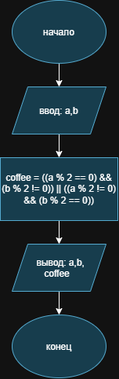

# Домашнее задание к работе 2

## Условие задачи

1. Ночное дежурство

Два программиста, Анна (A) и Борис (B), дежурят ночью. Чтобы было не так скучно, они решили, что будут пить кофе только если кто-то один из них четный (по номеру своего рабочего места). Запишите условие для кофе-машины.

**Вариант 1**
## 1. Алгоритм и блок-схема

### Алгоритм

1. **Начало**
2. **Ввести исходные данные:**
   
 • `a` - номер рабочего места Анны;
 
 • `b` - номер рабочего места Бориса.
 
3. **Составить условие для кофе-машины (четен только один из номеров):**
   
 • `coffee = ((a % 2 == 0) && (b % 2 != 0)) || ((a % 2 != 0) && (b % 2 == 0))`
 
 • значение `coffee` равно 1, если условие выполнено, и 0, если нет.
 
4. **Вывести номера рабочих мест и значение `coffee`.**
5. **Конец**
### Блок-схема

(https://drive.google.com/file/d/1Qvc29AV_na9xIWzkdbV6uztbjPGmv0bH/view?usp=sharing)
## Реализация программы
```c
#define _CRT_SECURE_NO_DEPRECATE
#include <locale.h>
#include <stdio.h>
#include <stdlib.h>

int main()
{
    int a, b;
    int coffee;

    setlocale(LC_ALL, "RUS");

    /* 1. Ввод номеров рабочих мест */
    puts("Введите номер рабочего места Анны (A)");
    scanf("%d", &a);
    puts("Введите номер рабочего места Бориса (B)");
    scanf("%d", &b);

    /* 2. Условие: четен только один из номеров */
    coffee = ((a % 2 == 0) && (b % 2 != 0)) || ((a % 2 != 0) && (b % 2 == 0));

    /* 3. Вывод результата */
    printf("Анна: место %d, Борис: место %d\n", a, b);
    printf("Кофе-машина включается, условие выполнено (1 - да, 0 - нет): %d\n", coffee);

    system("pause");
    return 0;
}
```
## Результаты работы программы
```
Введите номер рабочего места Анны (A)
445
Введите номер рабочего места Бориса (B)
234
Анна: место 445, Борис: место 234
Кофе-машина включается, условие выполнено (1 - да, 0 - нет): 1
```
## А чет В нечет
```
Введите номер рабочего места Анны (A)
2
Введите номер рабочего места Бориса (B)
3
Анна: место 2, Борис: место 3
Кофе-машина включается, условие выполнено (1 - да, 0 - нет): 1
```
## A нечет B чет
```
Введите номер рабочего места Анны (A)
3
Введите номер рабочего места Бориса (B)
4
Анна: место 3, Борис: место 4
Кофе-машина включается, условие выполнено (1 - да, 0 - нет): 1
```
## AB чет
```
Введите номер рабочего места Анны (A)
6
Введите номер рабочего места Бориса (B)
6
Анна: место 6, Борис: место 6
Кофе-машина включается, условие выполнено (1 - да, 0 - нет): 0
```
## AB нечет
```
Введите номер рабочего места Анны (A)
7
Введите номер рабочего места Бориса (B)
7
Анна: место 7, Борис: место 7
Кофе-машина включается, условие выполнено (1 - да, 0 - нет): 0
```
## Информация о разработчике

Бакатанова Алла, группа бИД-261 пдг2


